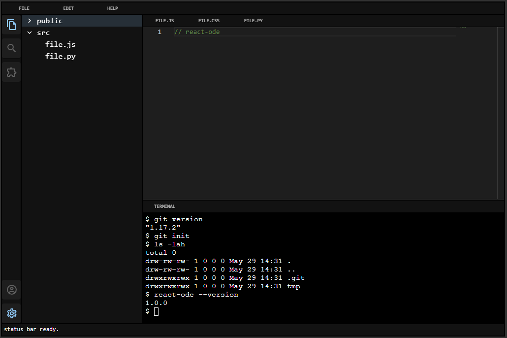

# react-ode

Embeddable Online Development Environment (ODE) as a React component library



## install

if you are not already in a react app, you can create a new one with:

```bash
npx create-react-app my-react-app
```

inside your react project, install peer dependencies first:

```bash
npm i @monaco-editor/react xterm memfs @mui/material @emotion/react @emotion/styled
```

then finally:

```bash
npm i react-ode
```

## mission

goal of this project is offering a lightweight and embeddable "vscode as a react" component.

it does so by offering a rich api over the combination of the following technologies:

- [Monaco Editor](https://www.npmjs.com/package/@monaco-editor/react): to handle the main editor user interface
- [Material UI](https://mui.com/material-ui/getting-started/installation): to handle non-editor user interfaces
- [memfs](https://github.com/streamich/memfs): to handle a virtualized filesystem for the editor
- [isogit](https://github.com/isomorphic-git/isomorphic-git): to handle git workflows
- [xterm.js](https://xtermjs.org): to handle rendering a virtualized terminal
  - [pyodide](https://pyodide.org/en/stable/): to offer a python shell
  - [v86](https://pyodide.org/en/stable/): to offer a general purpose shell

this is a visual component, meant to be embedded in higher order components and projects to build rich experiences.
